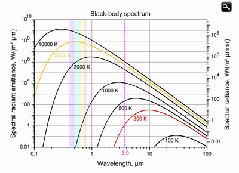

# Sigfox Flame Detector

## Introduction

How to prevent forest from burning? A small Sigfox signal can prevent this natural disaster. In this project, we will use an Arduino MKRFOX1200, a flame detector, a temperature and humidity sensors and we will send the data the TheThings.io platform.

I chose to put all the integrated electronic inside a small bird house, feel free to adapt the support!

Here it is what the first prototype looked like.

If you want to go further, you can add a solar panel with a charging circuit to charge a small battery, this part will not be covered by this tutorial. Feel free to submit a pull request on the [Github page](https://github.com/luisomoreau/SigfoxFlameDetector)

## What you need

* One [Arduino MKRFOX1200](https://www.arduino.cc/en/Main.ArduinoBoardMKRFox1200)
* One [flame detector](https://www.amazon.fr/Waveshare-Flame-Sensor-Detection-Raspberry/dp/B00NL5JEPS) or alternatively an IR led between 980nm and 1100 nm.
* A DHT11 temperature and humidity sensor.

## How to detect a fire using infrared sensors

I will try to be as much understandable as I can in this part. However, it is all about physics and I admit, I had some trouble to understand all the principles at the beginning.
I won't bother you the formulas but you can easily find them on Wikipedia.
In our case, a fire forest will mostly be a carbon fire.

Let's start with the Wien's law:

Black body radiation as a function of wavelength for various absolute temperatures. Each curve is seen to peak at a somewhat different wavelength; Wien's law describes the shift of that peak in terms of temperature.

Now look at this graph with the temperature we are interested in.

The wavelengths corresponding to the peak emissions of the Sun (5777 K), the Earth's surface (300 K) and forest fires (600 to 1000 K).

The dashed line represents the 3.9 μm band and you see from Wien's law that 3.9 μm is the wavelength at which a blackbody at 743 K has its peak. This temperature corresponds to the temperature of a fire!

However, it is hard to get a 3.9 μm IR led. So we will use an [IR LED](https://www.amazon.fr/Waveshare-Flame-Sensor-Detection-Raspberry/dp/B00NL5JEPS) between 980nm and 1100 nm in this tutorial which has the following properties:
* The operating voltage is from 3.3 – 5V.
* It gives us both analog and digital output.
* It has a led indicator, which indicates that whether the flame is detected or not.
* The threshold value can be changes by rotating the top of potentiometer.
* Flame detection distance, lighter flame test can be triggered within 0.8m, if the intensity of flame is high, the detection distance will be increased.
* The detection angle of the flame sensor module is about 60 degrees.

Additionally, to avoid false positive alerts, some systems use two or three different IR (or UV) sensors.

## Hardware wiring

